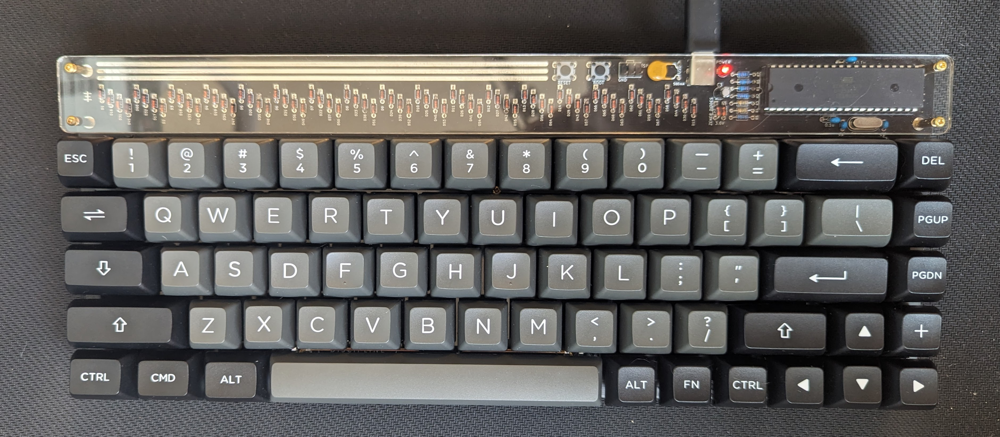

# My Discipline 65 Build

I love mechanical keyboards, so I finally decided to build one(Finally)

## Parts & Tools 
So I spent a lil much on it.. but that's the hobby, worth it
- [KDB Switch Opener - $25.00](https://kbdfans.com/products/gb-2-in-1-machined-aluminum-switch-opener?variant=21938345148464)
- [KBD Lubes tools - $4.90](https://kbdfans.com/products/kbdfans-lube-tools-collection?variant=34427340718219)
- [KBD 70 Gat inks - $75.00](https://kbdfans.com/products/gateron-ink-switches?variant=29235458277424)
- [Zeal KRYTOX GPL 205 G0 - $28.00](https://zealpc.net/products/lube?variant=14906580729919)
- [Zeal 3x 2u, 1x 6.25u stabilizers - $33.00](https://zealpc.net/products/zealstabilizers?variant=27196398790)
- [Amazon Side cutters - $22.98](https://www.amazon.ca/gp/product/B00FZPDG1K/ref=ox_sc_act_title_1?iismid=A3DWYIK6Y9EEQB&psc=1)
- [FB Market Place Akko Keycaps - $30.00](https://www.amazon.ca/Akko-Double-Shot-Mechanical-Keyboards-Collection/dp/B09RWQJPBT) 

## Firmware 
The firmware was already installed on the chip that came with the board. However, I've customized it to have similar shortcuts like the Vortex POK3R has. The QMK tools that have been developed are super awesome btw.

## Sins I commited while making the board
- Didn't start the build for 2.5 years(Whoops)
- Didn't test the pcb right away, so ended up with a broken trace
- Soldered a cable from the H key to a diode to fix the broken trace
- Put on the acrylic backplate, only for it to not fit properly, then solder on the switches anyway. Have it look super bad and not fit the case, _then cut the acrylic backplate off, it totally still isn't there too_. 

That last part physically hurts me to bring up. It's fine, you can't even see it. 😬

## Things I learned 
- I suck at soldering
- Building a keyboard is actually super fun
- Buy all all of the parts before you start
- Lubing switches takes longer than you think
- Test the board as soon as you get it, fully...
- How to use a multimeter to test continuity
- The true meaning of pain

## Picture
